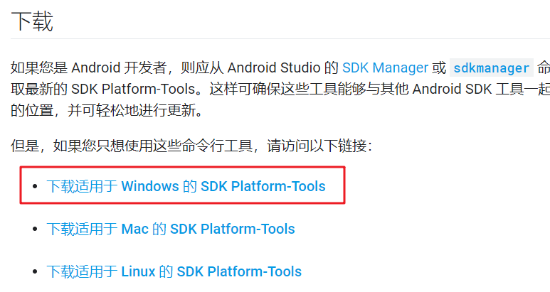

# 使用guiscrcpy投屏
categories: Git
[github项目地址]( https://github.com/srevinsaju/guiscrcpy#Installation )

对于Windows平台: 

* [下载安装包](https://github.com/srevinsaju/guiscrcpy/releases/download/1.10/guiscrcpy-1.10-27082019-windows.exe)(不要使用pip下载)

* 安装到`c:/program files(x86)`

* 找到`guiscrcpy`文件夹, 把它添加到PATH

* 安装adb

  * 从[这个网站]( https://developer.android.google.cn/studio/releases/platform-tools?hl=zh_cn )下载一个压缩包

    

  * 解压会看到一个叫`platform-tools`的文件夹, 放到到C盘根目录

  * 添加这个文件夹到PATH变量

  * 在cmd中输入adb, 如果看到一大堆输出, 表示已经安装成功

* 将手机USB调试打开(直接在设置里搜索USB, 一般在开发者选项里面) , 把手机用数据线连接到电脑

* 查看手机的ip地址(手机要和电脑放在同一个局域网内)

  * 设置-关于手机-状态-ip地址

* 在命令行使用adb连接手机

  * ` adb tcpip 5555 \\开启5555端口用于adb连接`
  * ` adb connect DEVICE_IP:5555 \\此时可以断开数据线连接 `

* 把命令行切换到`c:/program files(x86)/guiscrcpy`, 输入`guiscrcpy`, 即可运行.