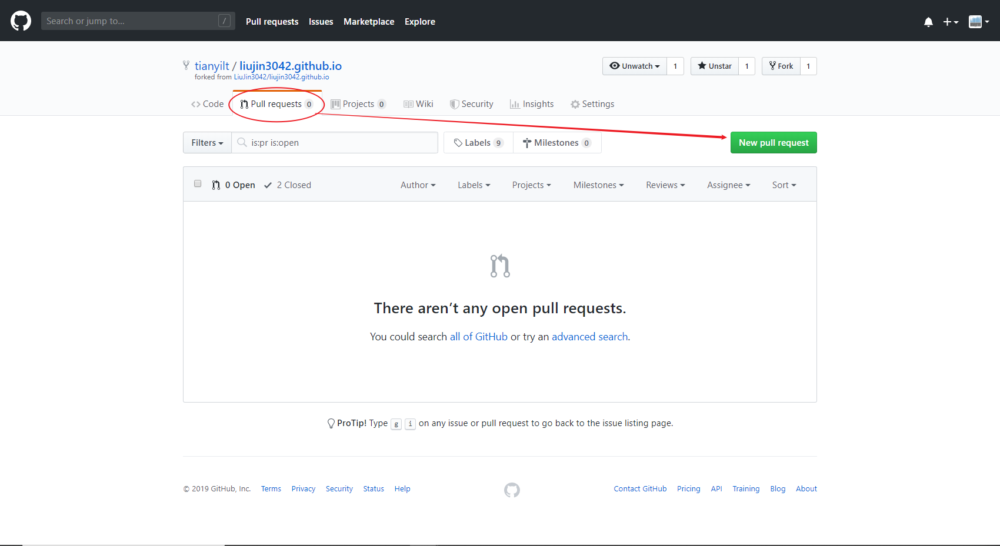

# 在github端fork远程同步
categories: Git
现在我们已经fork别人的一个远程仓库，经过一段时间，原仓库进行了一端更新，我们需要与远程的原仓库同步。

进入自己fork仓库的pull request

可以发现目前默认是从自己仓库同步到原仓库，需要交换标签顺序，首先把发起栏目改成原仓库

可是会出现这个页面

点击

 compare across forks

再把目标仓库换成自己fork仓库

可以从这里看到自己更新的内容

点击

自此，完成合并

从自己pull request到原仓库方法一样