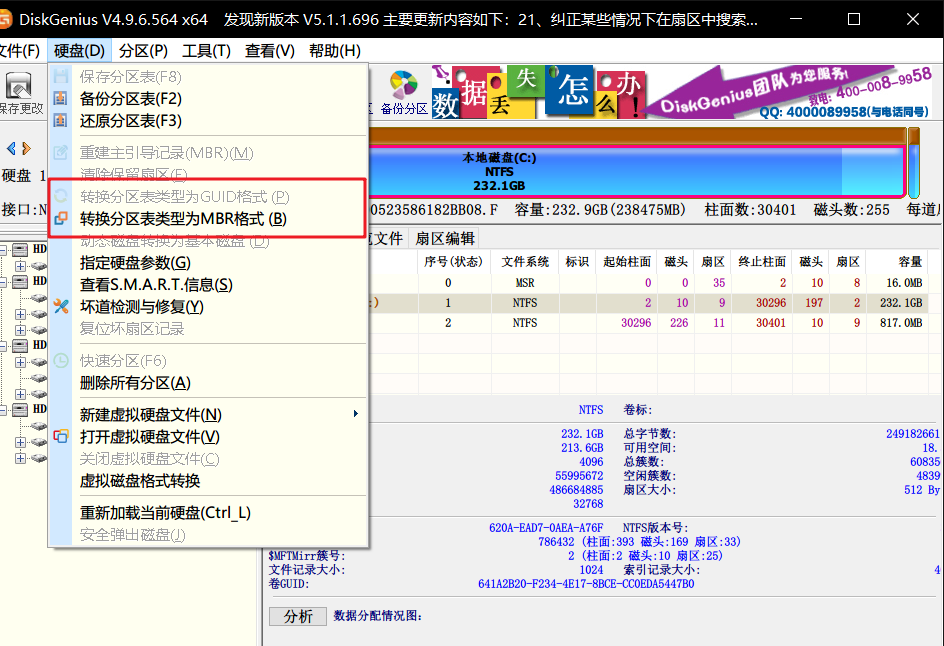

# Linux的磁盘格式
categories: Linux

1. NTFS: 微软专用的磁盘格式,  替代FAT.
2. EXT4: 第四代扩展文件系统. 
3. GUID: 全局唯一标识符, 128位, 显示硬件的唯一性.
4. UEFI: 统一的可扩展固件接口. 用于加载操作系统. 
5. MBR: 分区表类型: 主引导记录, 磁盘前面的引导代码. <u>将分区信息写道磁盘64个字节中</u>, 读写硬盘时判断分区的合法性, 分区引导信息. Linux系统中MBR是GRUB加载器. 电脑启动时, BIOS先读取MBR, MBR启动windows.
   * MBR分区可直接用的叫主分割(Primary), 不可直接用的叫扩展分割(Extended), 扩展分割最多一个.
   * Extended可以使用逻辑分区(Logical)来分割, 分区信息被记录到Extended中.
   * 可以有多达63个逻辑分区. 
6. GPT: 分区表类型: GUID Partition Table, 全局唯一标识磁盘分区表. 使用UEFI启动. 微软建议使用GPT. 
7. MSR: 微软保留分区. 一共备用. 在将磁盘转换为动态磁盘的时候会使用. 
8. ESP: EFI系统分区. EFI BIOS来启动操作系统. 
> 使用DiskGenius查看分区类型: 选择硬盘, 如果显示`转换为MBR分区`, 说明当前是GPT. 
> 

## Linux磁盘文件

1. Linux硬件都挂载到/dev/下, 
   * IDE接口的硬盘目录: `/dev/hd\[abcd][123456...]`, `a`对应第一个IDE槽的master, `b`对应第一个的slave. 1对应第一个分区. 如果配置为`2\*primary + 1\*logical`, 那么`primary`对应`hda1,hda2`, `extended`对应`hda3`, `logical`对应`hda4`.
   * SATA接口的硬盘目录: `/dev/sd[abcd...]`.
   * m.2接口: `/dev/nvme[0123...]n1p[1234...]`.

## Linux安装分区

1. /boot分区: 早年的bios只能读取1024个柱面. 如果启动文件放在前1024个柱面以外, 就无法读取. 因此需要专门划分100MB的/boot分区. 现在已不需要.

2. /swap分区: 虚拟内存. 服务器数据库需要大量读写的时候就尤为重要. 内存较小时, 大约是RAM的两倍.

   

