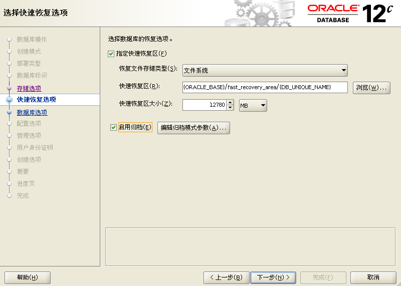

categories: oracle
# Oracle工作环境安装

[下载网站](https://www.oracle.com/database/technologies/oracle-database-software-downloads.html)


下载12cRelease2, (12.2.0.1.0)

[获取数据库帮助](https://docs.oracle.com/en/)

## Oracle管理员的任务

1. 确定服务器硬件
2. 安装Oracle软件
3. ...

## 用于管理Oracle的工具

* Oracle Universal Installer(OUI)
* Database Configuration Assistant(DBCA), 创建数据库
* Oracle Enterprise Manager(OEM)
* SQL Plus, 管理工具

## 安装开始

### 环境检查

* 系统要求(很重要)
  * 系统: Centos 7.3以上
  * 内存（交换空间）: 4G
  * 磁盘容量: 40G以上

* 检查版本

  ```bash
  cat /etc/redhat-release
  ```

* 检查内核

  ```bash
  uname -a
  ```

* 检查内存

  ```bash
  grep MemTotal /proc/meminfo
  grep SwapTotal /proc/meminfo
  ```

* 检查安装包

  linuxx64_12201_database, 3.3G左右

### 安装软件包

```bash
yum -y install binutils compat-libcap1 compat-libstdc++-33 gcc gcc-c++ glibc glibc-devel ksh libaio libaio-devel libgcc libstdc++ libstdc++-devel libXi libXtst make sysstat unixODBC unixODBC-devel
yum update
```

为虚拟机拍摄快照

### 配置安装环境

* 修改主机名为任意名称(**不能是localhost**), 改为例如cent7

  ```
  sudo vi /etc/hostname
  ```
  
  
  
* 创建用户和组(在root用户下)

  ```bash
  groupadd oinstall  
  groupadd dba    
  useradd -g oinstall -G dba oracle 
  passwd oracle
  ```

* 配置内存参数

  创建文件

  ```bash
  touch /etc/sysctl.d/97-oracledatabase-sysctl.conf
  ```

  写入内容(直接复制到命令行, 需要删去注释)

  ```bash
  cat >> /etc/sysctl.d/97-oracledatabase-sysctl.conf << EOF
  fs.aio-max-nr = 1048576  
  fs.file-max = 6815744    
  # shm, shared memory, 共享内存
  # 配置共享内存和文件操作符是为了开启自动存储管理（AMM, Automatic Memory Management）
  kernel.shmall = 2097152   #需要计算, 设置为shmmax/4096
  kernel.shmmax = 4294967295   #需要计算, 设置为物理内存的90%
  kernel.shmmni = 4096    
  kernel.sem = 250 32000 100 128    
  net.ipv4.ip_local_port_range = 9000 65500    
  net.core.rmem_default = 4194304 12c 262144   
  net.core.rmem_max = 4194304    
  net.core.wmem_default = 262144    
  net.core.wmem_max = 1048586
  EOF
  ```
  
  无注释版本
  
    ```bash
  cat >> /etc/sysctl.d/97-oracledatabase-sysctl.conf << EOF
  fs.aio-max-nr = 1048576  
  fs.file-max = 6815744    
  kernel.shmall = 2097152   
  kernel.shmmax = 4294967295   
  kernel.shmmni = 4096    
  kernel.sem = 250 32000 100 128    
  net.ipv4.ip_local_port_range = 9000 65500    
  net.core.rmem_default = 4194304 12c 262144   
  net.core.rmem_max = 4194304    
  net.core.wmem_default = 262144    
  net.core.wmem_max = 1048586
  EOF
    ```

  

* 启用配置

  ```bash
  sysctl --system # 立即生效
  sysctl -a |grep shmmax
  sysctl -a |grep shmall
  ```

* 配置资源限制

  ```bash
  cat >> /etc/security/limits.conf << EOF  
  oracle  soft  nproc  2047    
  oracle  hard  nproc  16384    
  oracle  soft  nofile  1024    
  oracle  hard  nofile  65536    
  oracle  soft  stack   3145728
  oracle  hard  stack   3145728  
  EOF
  ```

 * 修改本地hosts文件

   ```bash
   vi /etc/hosts 
   ```

   在最后一行加入`[ip地址] [主机名]`

   ```
   192.168.27.157 cent7
   ```

* 创建安装目录

  ```bash
  mkdir -p /u01/app/oracle
  chown -R oracle:oinstall /u01/app/
  chown -R oracle:oinstall /u01
  chmod -R 755 /u01/app/oracle/
  chmod -R 755 /u01/
  ```

* 安装rlwrap

  ```
  wget https://dl.fedoraproject.org/pub/epel/epel-release-latest-7.noarch.rpm
rpm -Uvh epel-release-latest-7.noarch.rpm
  yum install rlwrap -y
  ```

* 配置环境变量

  ```bash
  su - oracle
  (以下的中文不需要去除)
  cat >> /home/oracle/.bash_profile << EOF
  export EDITOR=vim 
  #oracle的BASE目录定义   
  export ORACLE_BASE=/u01/app/oracle 
  #oracle的HOME目录定义   
  export ORACLE_HOME=\$ORACLE_BASE/product/12.2.0.1/db_1    
  export ORACLE_SID=ORCL
  #重新定义系统环境变量
  export PATH=\$PATH:\$HOME/.local/bin:\$HOME/bin:\$ORACLE_HOME/bin 
  #简体中文版
  #export NLS_LANG="AMERICAN_AMERICA.ZHS16GBK"   
  export NLS_LANG="SIMPLIFIED CHINESE_CHINA".UTF8 
  #定义语系
  export LANG=zh_CN.UTF-8
  #export LANG=en_US    
  #export LC_ALL=en_US    
  export LD_LIBRARY_PATH=/lib:/usr/lib:\$ORACLE_HOME/lib    
  export CLASSPATH=\$ORACLE_HOME/JRE:\$ORACLE_HOME/jlib:$ORACLE_HOME/rdbms/jlib
  alias sqlplus="rlwrap sqlplus"    
  alias rman="rlwrap rman"    
  #权限（反码）
  umask 022    
  EOF
  
  source .bash_profile
  ```

* 关闭selinux和防火墙

  ```bash
  vi /etc/selinux/config
  ```

  把`SELINUX=enable`改为`SELINUX=disabled`

  ```bash
  systemctl stop firewalld.service
  systemctl disable firewalld.service
  ```

* 关闭透明大页
  查看

  ```bash
  cat /sys/kernel/mm/transparent_hugepage/enabled
  [always]代表启用
  [never]代表禁用
  ```
  
  修改
  
  ```
  vi /etc/default/grub
  GRUB_CMDLINE_LINUX="crashkernel=auto rhgb quiet transparent_hugepage=never"
  ```

  编译文件

  ```
  grub2-mkconfig -o /boot/grub2/grub.cfg
  ```


* 重启系统

  ```
  init 6
  ```

  检验有没有加进去

  ```
  cat /proc/cmdline 
  ```

### 安装oracle12c

先为虚拟机拍摄快照

* 需要使用远程安装的方式, 先安装`xmanager`

* 用xmanager下的xshell连接虚拟机

* (用户切换到oracle)将压缩包**通过xshell界面(否则会解压失败)**扔到`/u01`下

  * 方法0，直接
  	* ```bash
  		 	 cd /u01
  		```
  		
  		然后把文件拖进xshell
  * 方法1
    * 
    * 用xftp速度更快
  * 方法2：直接拷贝进vmware虚拟机内

* 友情提示，如果出现权限问题，路径问题，请使用chmod来授权与mv来移动路径

* 解压

  ```
  unzip ****.zip
  ```

* 安装

  ```
  cd /u01/database
  ./runinstaller
  ```

  如果出现错误`Error: Can't open display:`

  ```
  export DISPLAY=[主机和虚拟机同一个网段的ip]:0.0
  ```

如果一切正常, 会在主机弹出gui


* 最后会提示你用root身份执行两个脚本

  ```
  su -
  /u01/app/oraInventory/orainstRoot.sh   
  /u01/app/oracle/product/12.2.0.1/db_1/root.sh
  ```


看到这个直接回车


看到这个键入y然后回车

### 创建监听服务

* 切换到oracle用户

* 输入

  `netca`

* 然后在gui配置, 一路下一步

  

* 检验

  ```
  ps -ef |grep ora_
  ```


### 创建数据库

```
dbca
```





### 访问数据库

* 安装flash-player播放器插件

  前往[flash官网](https://www.flash.cn/)下载rpm包

  

  ```
  rpm -ivh flash-player-npapi-26.0.0.131-release.x86_64.rpm
  sqlplus / as sysdba
  alter user sys identified by [sys密码]; # 更改sys的密码, 可不用
  ```

* 在主机的**谷歌浏览器** 地址栏中输入

  ```
  https://[虚拟机ip地址]:5500/em/login
  ```

  会提示安装flash, 只要在网站设置里允许flash就可以了

  

  

  注意sys登录一定要勾选以sysdba身份

  成功登录.

  

  

### 其他配置

* 启动配置

  ```bash
  vi /etc/oratab  
  #把最后的N改成Y (默认是N)    
  orcl:/u01/app/oracle/product/12.2.0.1/db_1:Y
  # rc.local启动方式
  cat >> /etc/rc.local << EOF  
  # Oracle service start    
  su - oracle -c "lsnrctl start"    
  su - oracle -c "dbstart"    
  EOF
  
  chmod +x /etc/rc.local
  ```

* 进入数据库

  ```
  sqlplus / as sysdba
  ```

  可以看到提示符变为`SQL>`

* 安装完数据库密码过期问题

  (alter等命令都是在数据库管理模式下输入, 即提示符是SQL)

  ```
  SQL> alter profile default limit password_life_time unlimited;
  alter profile default limit failed_login_attempts unlimited;
  ```

* 取消段延迟特性

  ```
  alter system set deferred_segment_creation=false scope=both;
  ```

* 实例启动关闭

  ```
  startup
  shutdown immediate 
  ```

  查看实例状态

  ```
  select status from v$instance;
  ```

  

## 如果你很不幸

### 交换空间不足

查看swap交换空间方式一：

```bash
free -m
free -mh
```

可以看出只有2G，而安装需要有4G


使用dd命令创建一个swap交换文件：

```bash
cd ~
dd if=/dev/zero of=/home/swap bs=4096 count=1024000
```

制作为swap格式文件：

```
mkswap ~/swap
swapon ~/swap
```

然后查看一下

```
free -mh
```


### netca报错Failed to write core dump


首先确定xclock能看到

然后

```bash
vi /etc/hosts 
```

作以下修改ZS81V%60YG.png)

然后重启，在xmanager里面打开oracle