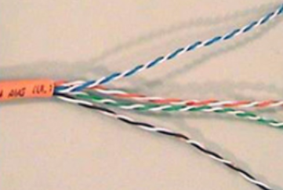
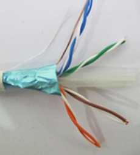
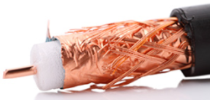
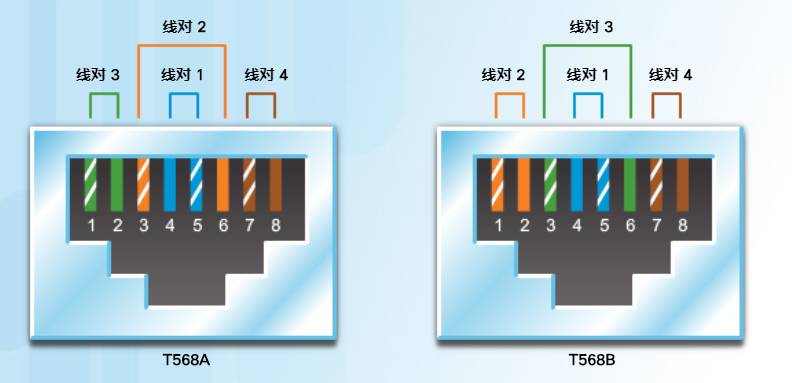
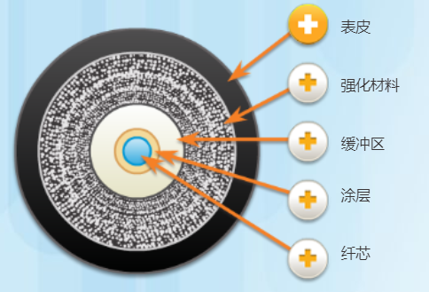

# 网络访问
categories: 思科1
## 物理层协议

### 物理层连接

* NIC, 网络接口卡, 以太网网卡用作有线连接
* ISR, 集成多业务路由器， 常用的家用路由器.
* WLAN, 无线网卡

### 物理层协议的作用

* 从数据链路层接受帧
* 把帧编码成电信号, 发送到介质上
* 检索信号, 还原为完整的帧, 传送给数据链路层

### 特征

* 物理层管理的功能区
  * 物理组件: 电子硬件设备, 介质和连接器. 用来传输位信号
  * 编码: 将数据位流转化为电信号的方法
  * 信令: 位的表示方法称为信令方法, 规定那种类型的信号代表1, 哪种代表0

* 带宽: 最多能承载的数据能力, 单位时间可以流向目的地的数据量, 单位是bit/s, 常用有Mb/s, 或Mbps
* 吞吐量: 给定时段内通过介质传输的位的量度, 与带宽不同, 带宽是理想最大值, 吞吐量是实际值.

## 网络介质

### 铜缆

 成本低, 易于安装, 电阻率低, 受到距离和信号干扰, 发送电脉冲信号. 容易受到两个干扰源的干扰: 

* 电磁干扰(EMI)或者射频干扰(RFI), 来源于无线电波和电磁设备(荧光灯, 电动机)
* 串扰, 电线中的电信号对周围电线照成的干扰, 来源于电话串线.

铜缆有以下几种类型

* 非屏蔽双绞线(UTP, unshielded twisted pair), 四对绞起来的线. 双绞线防止信号受到干扰, 铜线外包裹彩色塑料绝缘层(看到是彩色的线), 用颜色区分每个线对, 使用RJ-45连接器端接.

* 屏蔽双绞线(STP, shielded twisted pair), 比UTP多裹了一层覆盖的金属屏蔽层(法拉第笼), 使用RJ-45连接器端接. 如果接地不正确, 反而会接受多于信号. 

* 同轴电缆, 几乎被淘汰. 从内到外依次是: 导线-绝缘层-铜网屏蔽层-塑料保护层. 用于无线安装或有线互联网安装. 可以连接BNC口, N口, F口.

### UTP布线

* 两根电线紧密排列, 彼此磁场恰好相反, 磁场抵消, 也消除了EMI和RFI干扰, 不同颜色的线绞合密度不同. 遵循TIA/EIA 共同制定的标准TIA/EIA-568, 定义了电缆类型, 长度, 连接器, 电缆端接, 测试电缆的方法.

* 分类

  * 3类: 线没有绞合, 带宽一般, 用作电话线
  * 5(Cat5)类, 增强型5类/5e类(Cat5e): 线按照一定规格绞合, 用于百兆网
  * 6(Cat6)类: 绞合的线外面包裹了分隔物, 支持千兆传输. 推荐使用

* 采用RJ-45连接器, 遵循TIA/EIA-568标准. 8根线, 只用到了1236四根线, 12负责输入, 36负责输出.注意正反面. 图中是宽的面在上.  

  

  * 对于同种设备, 发送端的36要对应接收端的12. (交叉电缆), 包括主机-主机, 交换机-交换机, 路由器-路由器. 一端是T568A, 另一端T568B.
  * 如果是异种设备, 两种设备12对应12, 36要对应36.(直通电缆). 包括主机-交换机, 主机-集线器

* 传输距离100m

### 光纤

发送光脉冲信号, 从内到外为: 纤芯(玻璃制成)-涂层(反射用)-缓冲区(保护)-强化材料(保护)-表皮(保护)

* 单模光纤: 数百公里, 用激光发射, 很细, 几乎不反射
* 多模: 较粗, LED光源, 光反射
* 信号损失发生在光纤到接口上
* OTDR, 光时域反射器, 根据反射光传输时间定位损坏位置

### 无线

发送微波信号, 802.11标准

* 无线接入点AP, 集中用户的无线信号, 并连接到现有基于铜介质的网络基础设施, 如以太网.

## 数据链路层

### 职能

* 允许上层访问介质
* 接受第 3 层数据包，并将它们打包为帧

- 为物理网络准备网络数据

- 控制数据在介质中的放置和接收方式

- 在物理网络介质（例如 UTP 或光纤）中的节点之间交换帧

- 收数据包并将其传输给上层协议

- 执行错误检测

分为两个子层:

* LLC, 逻辑链路控制, 根据网络层协议进行封装

* MAC, 介质访问控制, 对接物理标准, 把帧放到介质上, 从介质上获取帧. 不同的介质需要使用不同的数据链路层协议. 转发信息时, 需要接收帧-解封-重新封装-发送

  需要解决以下的问题

  * 拓扑-节点之间的连接如何显示在数据链路层中
  * 介质共享-如何共享介质

### 拓扑

网络设备以及互联布局或关系. 分类有: 

* 物理拓扑, 表示终端设备和基础设施设备, 突出设备位置, 设备种类
* 逻辑拓扑, 突出ip地址, 连接端口

### 物理WAN拓扑

* 点对点
  * 节点1-网络-节点二
  * 不用共享介质, 判断帧的目的地址
* 中心型
* 网状

### 物理LAN拓扑

* 星型
  * 集线器(假星型, 其实还是总线型, 公用带宽)
    * 连接所有的点
    * 载波侦听多点接入/冲突检测CSMA/CD, 监听-冲突-等待-重发
    * 利用效率低
  * 交换机(真星型, 独享带宽)
    * 点对点通路
  * 路由器
    * 隔离广播, 广播不允许通过
* 总线
* 环
* 扩展星型(多个星型相连)
* 单工, 半双工, 双工: 单工: 发射接收角色不互换, 半双工(集线器), 发射接收不同时, 双工(交换机), 同时.
* 争用访问-CSMA/CD, 载波侦听多路访问/冲突**检测**机制, 用于半双工, 需要一个进程管理设备合适可以发送以及多设备同时发送的处理. 进程如下:
  * A想要发送帧
  * 检测是否有人传输, 如果没有, 发送
  * 集线器接收帧
  * B设备想发送, 必须等待
  * 所有设备接收到帧, MAC地址匹配的主机接收整个帧
  * 两台设备同时传输造成冲突, 两台设备都将检测到, 数据损失. 等待一段时间重新发送.
* 争用访问-CSMA/CA, 载波侦听多路访问/冲突**避免**机制, 数据包包含自己的长度. 其他设备收到此信息, 就会知道介质不可用时间, 在此期间停止传输. 接收方收到之后, 返回确认信息, 表示帧已到达. 用于无线连接. 全双工. 不会检测冲突, 而是在传输之前等待来避免冲突

### 数据链路帧

* 帧: 帧头, 数据, 帧尾
* 帧头
  * 帧开始和停止标志, 标识帧的开始和结束位置的限制
  * 编址, 表示介质上的源节点和目的节点. 用MAC地址. 还包含了源地址.
    * 路由器用IP地址确定通往目的设备的最佳路径
    * 路由器重新填写MAC地址, 转发到下一级
  * 类型, 用于标识数据字段中的第 3 层协议
  * 控制, 用于标识特殊流量控制服务, 例如QoS, 某些信息有优先权. 
* 帧尾
  * 错误检测
  * 帧结束
* 协议种类
  * 802.11无线帧
  * 以太帧
  * ......