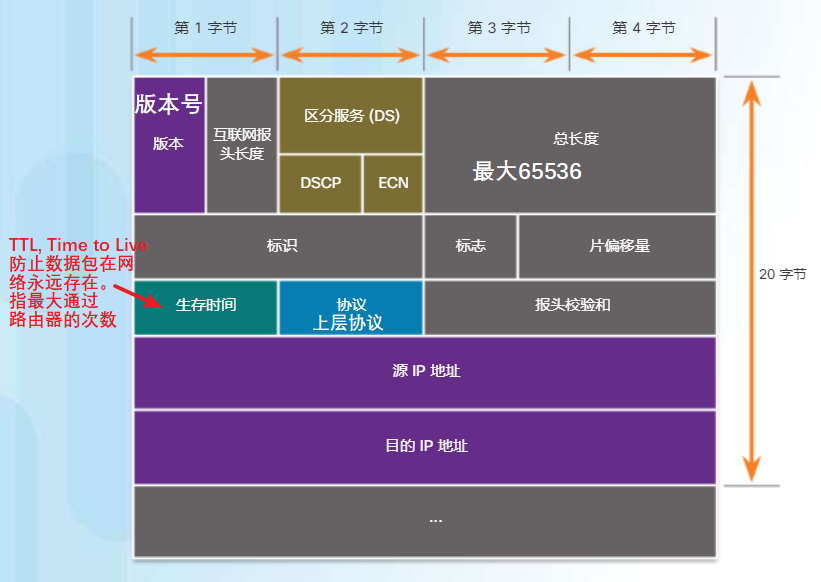
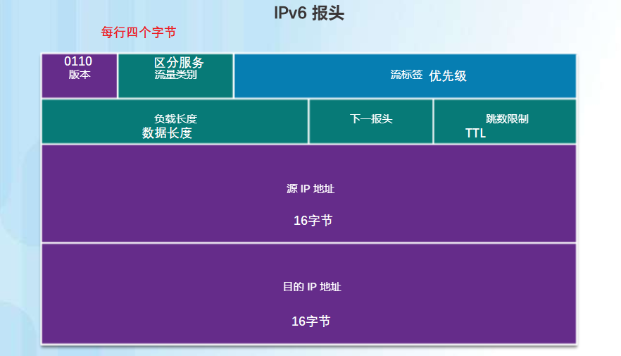
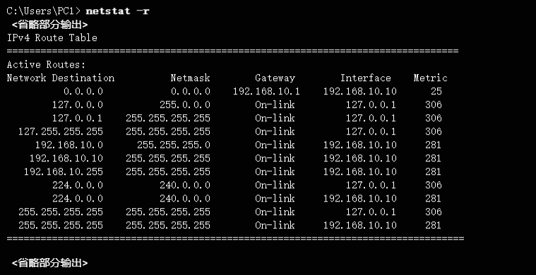
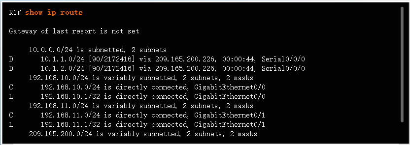
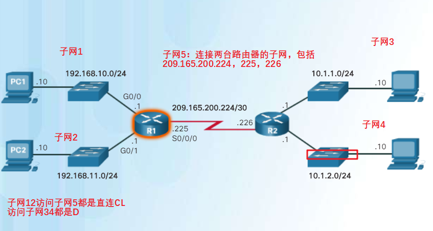
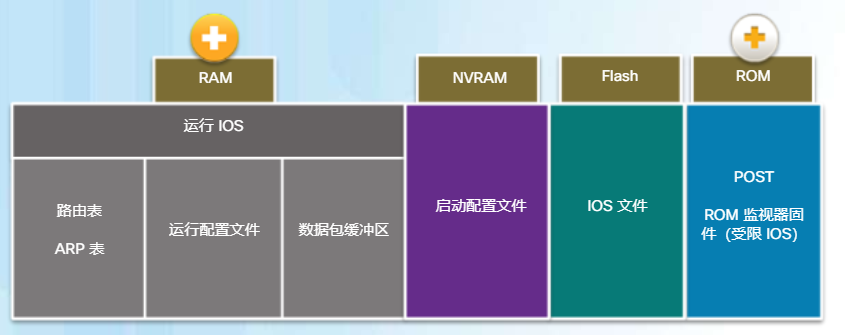
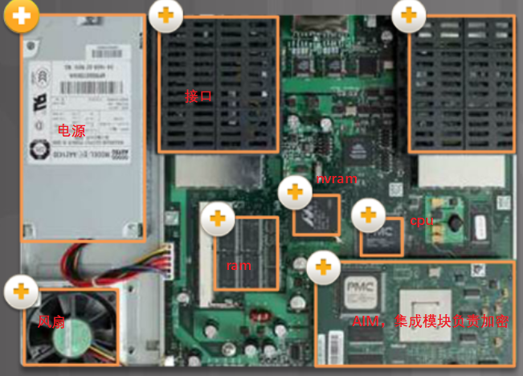
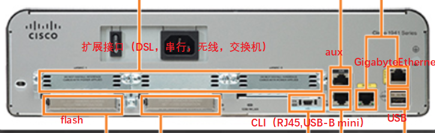
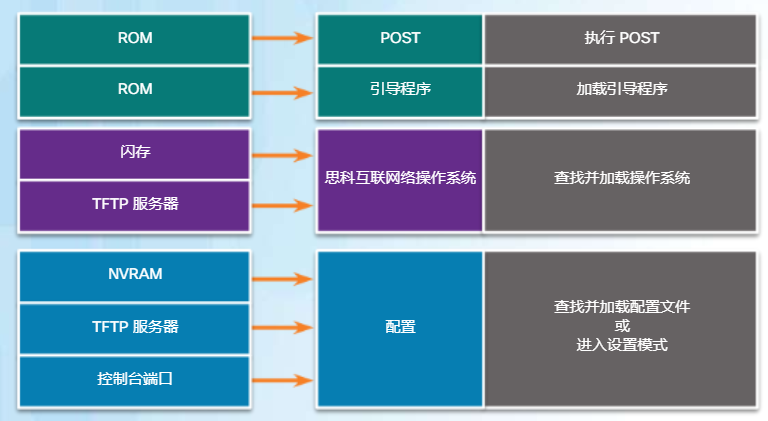

# 网络层
categories: 思科1
## 网络层协议

### IP协议特征

* 封装, 添加报头, 路由至目的设备
* 无连接
  * 发送方不确定对方是否在侦听, 或者消息是否准时
  * 接收方不知道数据到达
* 尽力交付, 不保证送达
* 和传输介质无关

### 报头



### IPv6数据包



## 路由

### 主机路由方式

* 转发决策
  
  * 三种目的地: 自己, LAN中主机, 远程主机
    * 自己: ping 127.0.0.1. 对环回接口执行 ping 操作可以测试主机上的 TCP/IP 协议堆栈.
    * 本地主机: 一般交换机即可完成作业, 目前路由器都集成了交换机功能. 不需要经过默认网关
* 默认网关
  * 对于终端电脑, 要与远程主机通信, 就要把信息发到默认网关, 网关转发(称为路由). 
  * 拥有一个本地ip, 一个公网ip
  * 可以转发数据
* 主机路由表包括默认网关, 主机通过动态主机配置协议 (DHCP) 动态接收默认网关 IPv4 地址或手动配置 

### 路由器路由表


* `route print`, 查看路由器信息



* 路由器上的路由表



* 内容分析


* C: 直连
* L: 本地
* 目的网络`192.168.10.0/24`是一个子网, `192.168.10.1/32`是子网内路由器的地址
* `GigabitEthernet0/0`: 数据包到目的地从这个接口出去

* 

  * D/S/O: 路由来源, 确定路由器如何获得网络
    * D: 增强型内部网关路由选择协议(EIGRP)
    * S: 静态路由
    * O: 开放最短路径优先(OSPF)
  * `10.1.1.0/24`: 确定目的网络
  * `90`: 路由来源的管理距离, 越低越好
  * `2170112`: 衡量路由好坏的参数, 越低越好
  * `209.165.200.226`: 下一跳路由器的地址
  * `00:00:05`: 路由最后一次侦听时间
  * `Serial0/0/0`: 数据包传出接口

* 

* 

## 路由器

### 路由器的特点

* 路由器是电脑. 用户配置放到NVRAM中, 操作系统在FLASH中, 有RAM, 主板, CPU等.
* 有不同级别的路由器, 包括民用的继承多业务路由器(ISR), 大企业的多业务路由器(ASR), 服务提供商的路由器.

* 路由器存储器

  

  

  

* 启动IOS

  

## 配置路由器

### 基础配置

* 交换机 | 路由器

  基本配置配置单

  ```
  配置设备名称
  	hostname 名称
  保护用户模式
      line console 0
      password 口令
      login
  保护远程 Telnet / SSH 访问
      line vty 0 15
      password 口令
      login
  保护特权模式
  	enable secret 口令
  保护配置文件中的所有密码
  	service password-encryption
  提供约定通知
  	banner motd delimiter message delimiter
  配置管理 SVI
      interface vlan 1
      ip address ip-address subnet-mask
      no shutdown
  ```

  操作

  ```
  Switch> enable
  Switch# configure terminal
  Switch(config)# hostname S1
  S1(config)# enable secret class
  S1(config)# line console 0
  S1(config-line)# password cisco
  S1(config-line)# login
  S1(config-line)# line vty 0 15
  S1(config-line)# password cisco
  S1(config-line)# login
  S1(config-line)# exit
  S1(config)# service password-encryption
  S1(config)# banner motd #No unauthorized access allowed!#
  S1(config)# interface vlan1
  S1(config-if)# ip address 192.168.10.50 255.255.255.0
  S1(config-if)# no shutdown
  S1(config-if)# end
  S1# copy running-config startup-config
  Destination filename [startup-config]?
  Building configuration...
  [OK]
  ```

* 给交换机配置默认网关

  ```
  S1(config)# ip default-gateway 192.168.10.1
  ```

  

* 路由器

  给端口配置IP地址

  ```
  R1# conf t
  Enter configuration commands, one per line.
  End with CNTL/Z.
  R1(config)#
  R1(config)# interface gigabitethernet 0/0
  R1(config-if)# ip address 192.168.10.1 255.255.255.0
  R1(config-if)# description Link to LAN-10
  R1(config-if)# no shutdown
  %LINK-5-CHANGED: Interface GigabitEthernet0/0,
  changed state to up
  %LINEPROTO-5-UPDOWN: Line protocol on Interface
  GigabitEthernet0/0,changed state to up
  R1(config-if)#exit
  R1(config)#int g0/1
  R1(config-if)#ip add 192.168.11.1 255.255.255.0
  R1(config-if)#des Link to LAN-11
  R1(config-if)#no shut
  ```

  检验配置

  ```
  R1# show ip interface brief
  R1# ping 209.165.200.226
  R1# show ip brief
  ```

  