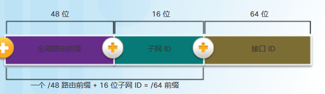

# 对IP网络划分子网
categories: 思科1
## 对IPv4网络划分子网

### 网络分段

#### 广播域

* 广播可以用来发现其他设备的ip地址, 或者通过dhcp获取ipv4地址
* 交换机将广播转发到除接收端外所有接口(**泛洪**)
* 路由器**隔离**广播, 广播能到达的区域称为广播域

#### 广播域过大

* 网络流量大, 效率低下
* 设备处理过多广播
* 划分子网, 避免广播域过大

#### 子网划分的情况

* 按照地理位置划分
* 按照设备类型
* 按照组织单位

#### 八位组边界

* 前缀长度为8/16/24/
* 网络部分不能变, 从主机部分"借"位数组成子网, 剩下的是子网里面的主机
* 例如, 主机部分24位, 借8位做子网, 那就有256个子网, 剩下16位, 就有2^16-2个主机
* 表示为`x.x.x.x/16`

#### 无类子网划分

* /n, 表示前n个是网络+子网地址, 后32-n个是主机地址

* 从/24的网络借1位, 能划出两个子网, 范围是0-127, 128-255. 借两位, 就是四个子网, 从0-63, 64-127, ...
* 借用n位, 子网有2^n个, 网络内主机有2^(x-n)个, x是子网+主机的总长. 

### 可变长子网掩码

* 从需求最大的子网开始划分, 知道最小的子网
* 通过对子网再划分子网

### 对路由器和交换机设置子网

1. 基础设置

   ```
   en
   conf t
   hostname 
   banner motd ''
   enable secret cisco
   line console 0 
   pass class
   login
   line vty 0 15
   pass class
   login
   exit
   ```

2. 配置ip地址

   * 首先需要通过路由表确定端口连接的是哪个子网

     ```
     show ip route
     show ipv6 route
     ```

   * 配置ip地址和子网掩码

     ```
     inter g0/0
     ip addr 192.168.100.64 255.255.255.224 // 根据实际情况确定
     // 子网掩码不可以用前缀缩写
     ```

   * 如果是交换机, 配置vlan端口地址

     ```
     interface vlan 1
     ip addr ...
     ```

   * 设置默认网关

     ```
     (config terminal)ip default-gateway 192...
     ```

   

## 对IPv6网络设计子网

### IPv6全局单播地址



* 全局路由前缀: 供应商分配的地址, 48位
* 子网ID: 用来确定子网, 16位, 可以创建2^16个子网
* 接口ID: 主机部分.