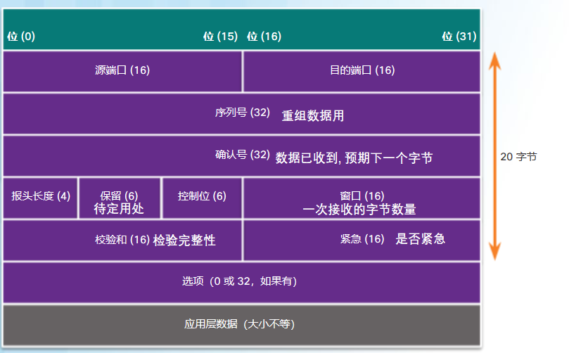
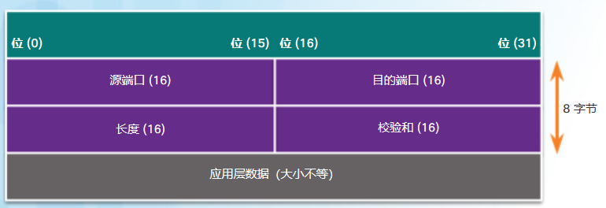
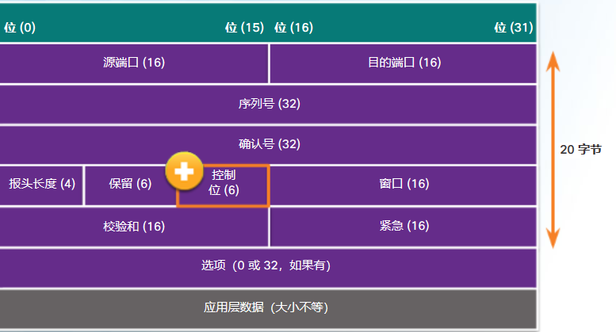

# 传输层
categories: 思科1
## 传输层协议

### 传输层原理

* 传输层负责在应用之间建立临时会话和传输数据. 从源主机的某程序生成数据传输到目标主机. 
* 会话: 源程序和目的程序传输的每个数据集称为一个会话
* 传输层负责跟踪会话, 把数据段切块加上报头, 重组数据段, 用端口号标识应用程序
* 多路复用: 把数据切成很小的块, 交替传输, 避免一个很大的块占用带宽
* TCP: 传输控制协议,  可靠且功能齐全,  确保所有数据到达目的设备, 报头复杂, 延迟高. 数据包需要确认收到, 没有确认, 会重发
* UDP: 用户数据报协议, 对可靠性要求不高的传输, 精简. 

### TCP功能

* 建立会话:  在源设备和目的设备之间协商并建立永久连接(或会话), 协商转发流量, 通信数据得到管理. 
* 可靠传输: 丢失补发
* 同序船速: 用序列号编排数据段
* 流量控制: 接收方处理能力有限的时候, 会请求原应用程序降低数据流速

#### TCP报头

### UDP功能

* 数据按接收顺序重构
* 丢失数据不重传
* 不建立会话
* 不告知发送方资源可用性的信息

#### UDP报头

### 端口号

端口号用来表示会话

*  源端口号由发送方设备动态生成 
* 目的端口常常是固定的
  * POP3--110
  * HTTP-80
  * IM-531
* IP+端口组成了套接字
* 一个程序对应一个端口

端口号分类

* 公认端口0-1023, 用于固定的服务
* 注册端口1024-49151, 用于用户选择安装的一些应用程序
* 动态/私有端口49152-65535,  在开始连接服务时由客户端操作系统动态分配 , 在通信期间识别客户端应用程序

### netstat

查看活跃的TCP连接

## TCP和UDP

### TCP通信进程

三次握手的消息都是在TCP报头的控制位中.

ACK-确认字段有效, =收到字节数+1

SYN-同步序列号

FIN-发送方不再发送数据

* 建立连接-三次握手
  * A发送SYN(SEQ=100, CTL=SYN), B接收SYN, 
  * B发送SYN(SEQ=300, ACK=101, CTL=SYN&ACK), ACK, A接收SYN, ACK
  * 建立(SEQ=101, ACK=301, CTL=SYN&ACK)

* 终止会话
  * A发送FIN, B接收FIN
  * B发送ACK, A接收ACK
  * B发送FIN, A接收FIN
  * A发送ACK, B接收ACK

### TCP可靠性和流量控制

* 使用序列号ISN标识数据段先后顺序
* ISN从一个随机的数开始(防止攻击), 发送一个字节增加1, 
* 窗口表示目的设备一次能处理的字节数, 在三次握手期间确定. 发送数据总大小不能超过窗口. 
* 滑动窗口
  * A向B发送数据, 假设窗口大小为N. A发送了X个数据(X<N)
  * B报告A他已经接收了m个数据
  * 窗口大小调整为m+N, 这样A就可以多发送m个数据
  * 这种方式可以保证A发送的数据永远在B处理范围以内
* 流量控制
  * 如果大量丢包, 发送端会减少发送的字节数, 直到收到正常数量的确认信息

### UDP低开销和可靠性

* 按照接收的顺序重组数据报
* UDP客户端进程从可用端口号动态挑选一个端口, 作为会话的源端口

### 使用TCP的应用

* FTP
* SMTP
* HTTP
* Telnet

### 使用UDP的应用

流媒体, 简单的请求和应答, 不必高可靠的应用

* SNTP
* TFTP
* DNS
* DHCP
* VoIP
* IPTV

