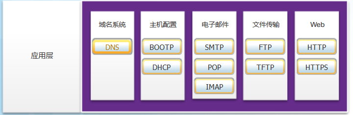

# 应用层
categories: 思科1
## 应用层协议

### 应用层, 表示层, 会话层

#### 应用层

最接近用户. OSI的应用层, 表示层, 会话层对应了TCP/IP的应用层

#### 表示层和会话层

表示层的功能

* 数据格式化
* 数据压缩
* 加密数据

包括了各种文件标准, MPEG, GIF, JPG, PNG等

会话层的功能

* 创建和维持会话
* 重启会话

#### TCP/IP应用层

 指定了许多常见 Internet 通信功能必需的格式和控制信息 

### 交互

#### 客户端-服务器模式

客户端请求信息, 服务器想要请求

#### 对等网络

P2P, 角色在客户端和服务器之间互换

#### 对等应用程序

同时充当客户端和服务器的应用程序

例如即使消息

## 常用应用层协议

### web和email

#### HTTP和HTTPs

三种消息类型为get/post/put

https的数据流通过ssl加密

#### 电子邮件

* SMTP

  邮件有报头和正文, 公认端口25, 客户端把邮件给服务器, 服务器转发邮件. 目标不可达时会尝试重发, 一段时间无法重发会将邮件退回.

* POP

  检索邮件, 邮件下载到客户端后就从服务器删除. 端口110

* IMAP

  原始邮件会存在服务器上. 有文件结构, 便于管理. 可以手动删除

### IP编址

* DNS层级
  * www.baidu.com
  * 域名越往上, 层级越高
  * 查询IP, 先查.com, 再查baidu.com, 最后查www.baidu.com
* nslookup, 手动查询dns服务器IP地址

* 动态主机配置协议DHCP, 可以减少配置工作量, 减少错误
  * 通过广播请求DHCP服务器响应
  * 服务器回复, 提供IPv4地址, 子网掩码, DNS服务器的IPv4地址和默认网关, 还有地址的使用期限.

### 文件共享

#### 服务器消息块SMB

* 功能
  * 启动, 身份验证, 终止会话
  * 控制文件和打印机访问(Windows文件共享, 连接打印机等)
  * 允许应用程序向任何设备发消息

#### 文件传输协议FTP

* 客户端与服务器用21端口建立一个用于控制传输的会话
* 用20端口传输数据
* 可以上传也可以下载