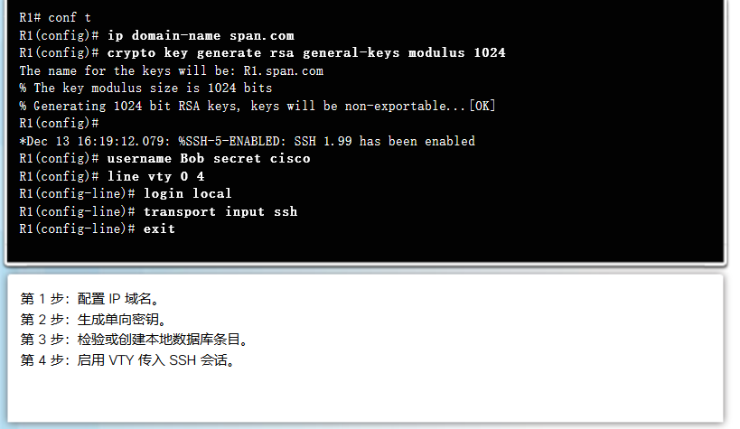

# 构建小型网络
categories: 思科1
## 网络设计

### 小型网络中的设备

#### 设备选择

* 成本: 冗余量, 性能要求，布线费用， 安全技术
* 端口: 前瞻性
* 扩展性: 模块化设备便于扩展
* 操作系统, 网络设备的功能

#### 冗余

高可靠性. 

例如: 多个默认网关提供单个互联网出口点

#### 扩展网络要考虑的要素

* 网络文档: 物理拓扑和逻辑拓扑

* 设备清单

* 预算

* 流量分析

  捕获高峰期的流量, 了解流量类型

  争夺不同网段捕获流量

## 网络安全

### 威胁类型

* 数据丢失
* DoS
* 身份盗窃
* 信息盗窃

### 物理安全

* 硬件威胁: 物理破坏
* 环境威胁: 极端环境造成破坏
* 电气威胁: 供电问题
* 维护威胁: 静电处理缺失/备用件缺失/布线混乱

### 漏洞类型

* 技术漏洞
* 配置缺陷
* 管理漏洞

### 恶意软件

* 病毒: 把自身的副本插入另一个程序, 借助其传播. 宿主程序被执行的时候也会执行. 破坏系统.
* 蠕虫: 独立软件, 利用网络自主传播
* 特洛伊木马: 看起来合法的有害软件. 只通过用户交互传播.

### 攻击手段

* 侦察攻击: 查询攻击对象在互联网上的信息, 测试IP地址段, 端口扫描, 数据包嗅探
* 访问攻击: 密码攻击, 信任利用(通过系统A信任的系统B攻击系统A), 端口重定向, 中间人
* 拒绝服务攻击: 耗尽系统资源, 阻止系统服务
  * 死亡之ping, 异常的ping数据包
  * syn泛洪: 发送大量的syn, 让服务器等待完成三次握手, 正常用户不可访问
  * DDoS, 僵尸计算机攻击受害主机
  * Smurf, 发送大量ICMP淹没到达受害主机的线路

### 防范

* 更新系统
* 身份验证, 授权, 记账(记录行为)

* 防火墙
  * 数据包过滤: 根据IP或MAC允许或阻止访问
  * 应用程序过滤: 根据端口号允许或阻止
  * URL过滤: 根据URL
  * 状态包侦测(SPI):  传入数据包必须是对内部主机请求的合法相应, 否则数据包会被拦截

### 实践

* 强密码

  ```
  (config)# security passwords min-length // 限制长度
  (config)# login block-for 120 attempts 3 within 60 // 60s内3次失败将锁定120s
  ```

* SSH

  ```
  // 确保路由器有唯一主机名
  (config)# ip domain-name //配置IP域名
  (config)# crypto key generate rsa general-keys //生成密钥
  (config)# username // 创建数据库用户名条目
  (config)# line vty 0 4
  (config-line)# login local
  # transport input ssh
  exit
  ```

  

### 基础网络性能

```
arp -d * // 清除arp缓存(windows)
show cdp neighbours // 发现cdp邻居的信息

```

