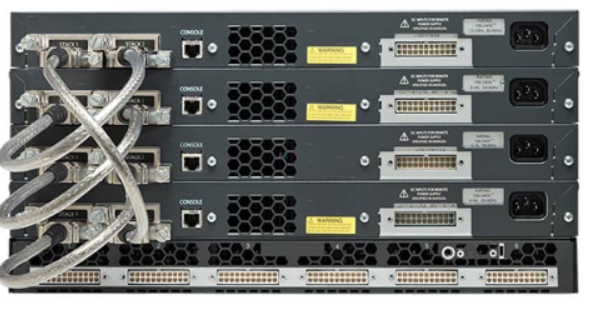

# 交换网络
categories: 思科2
## LAN设计

### 融合网络

#### 无边界交换网络的层次结构

* 分层: 简化部署
  * 接入层: 用户pc连接的一层, 网络边缘.
  * 分布层: 接入ISP
  * 核心层: 网络主干
* 模块化: 无缝网络扩展
* 恢复能力: 保持网络运行
* 灵活性: 只能流量负载

### 交换网络

#### 选购交换机

* 成本

* 接口密度: 接口不要空余. 一般有12, 24, 48接口

* 电源: 冗余电源

* 可靠性

* 端口速度

* 帧缓冲

* 扩展性: 交换机的菊花链可以连接交换机做成一个大交换机

  

  

### 帧转发

交换机根据入口端口和目标地址转发帧

* 存储转发: 循环冗余检查CRC, 检查帧(通过FCS校验)是否有错再转发
* 直通交换: 直接转发

### 交换域

#### 冲突域

设备之间共享带宽的网段是冲突域. **半双工**的交换机, 每个网段都是冲突与. **全双工**则没有这个问题.

#### 广播域

路由器的一个接口就是一个广播域. 因为广播无法通过路由器.

交换机接收到广播会范洪处理, 除了接收端口以外转发到其他端口.

广播MAC地址为`FF-FF-FF-FF-FF-FF`

#### 缓解网络拥塞

* 高端口密度
* 大型帧缓冲区
* 端口速度
* 快速内部交换
* 低的端口成本