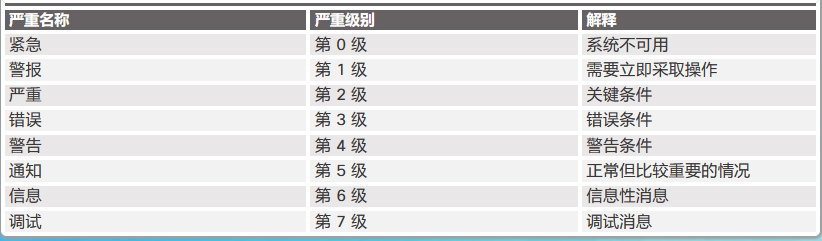
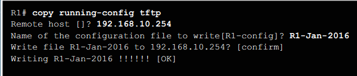

# 设备发现, 管理, 维护
categories: 思科2
## 设备发现

### CDP

CISCO DISCORY PROTOCAL, 是一个思科专有第 2 层协议, 共享同一数据链路的思科设备的信息. 默认开启. 

* 有关命令

  ```
  show cdp // 查看cdp+
  show cdp neighbours // 查看发现的设备
  show cdp neighbours detail // 详细信息
  show cdp interface // 查看启用的接口
  (config) # cdp run // 启动cdp
  (config) # no cdp run // 全局禁用cdp, 最好这样做
  (config) # inter g0/0
  (conf-line) # cdp enable // 在端口上开启cdp
  (conf-line) # no cdp enable // 在端口上关闭cdp
  ```

### LLDP

链路层发现协议 (LLDP), 国际通用协议. 

* 有关命令

  ```
  (config)
  lldp run
  inter g0/1
  lldp transmit
  lldp recieve
  exit
  exit
  (en)
  show lldp
  show lldp neighbours
  show lldp neighbours detail
  ```

  

## 设备管理

### NTP

使用NTP设置系统时钟

* 手动配置时间

  ```
  clock set 20:01:00 dec 11 2019
  ```

* 用ntp设置时间

  ```
  show clock detail
  conf t
  ntp server 209.168.200.225
  exit
  show ntp associations // 显示关联的ntp设备信息
  show ntp status // 显示本机ntp信息
  
  ```

  

ntp时间层级概念:

第0层: 权威时间源, 计时用.

第1层: 从权威时间源获取时间.

第n层: 从第n-1层获取时间

第16层: 表示设备不同步

### 系统日志

日志的功能

- 能够收集日志记录信息来用于监控和故障排除        

- 能够选择捕获的日志记录信息的类型   

- 能够指定捕获的系统日志消息的目的地

系统日志消息的常用目的地

- 日志记录缓冲区（路由器或交换机内部的 RAM）     

- 控制台线路       

- 终端线路    

- 系统日志服务器

设备可以配置为将所有系统消息转发到外部系统日志服务器, 内部缓冲区的日志只能从CLI上看到.

日志级别: 级别越小, 越紧急



日志的构成

```
seq no(日志的序号, 需要先配置service sequence-numbers) - 
timestamp(日志时间戳, 需要先配置service timestamp与ntp) - 
facility(来源设备) - 
severity(严重性, 上面的0-7) - 
MNEMONIC(简短的助记符) - 
说明(详细报告)
```

* 开启时间戳

  ```
  conf t
  inter g0/0
  shutdown
  exit
  (config)
  service timestamps log datetime
  inter g0/0
  no shut
  ```

  

* 相关命令

  ```
  show logging //查看日志记录设置
  (config)
  logging 192.168.1.4 // 配置log服务器
  logging trap 4 // 显示0-4级log
  logging source-interface g0/0 //指定系统日志数据包包含特定接口的 IPv4 或 IPv6 地址
  logging console // 把所有级别的日志都输出到console
  logging buffered // 缓冲系统日志消息
  ```

## 设备维护

### 路由器交换机文件维护

* 文件系统

  ```
  show file systems // 查看文件系统
  dir // 列出文件, 类似ls
  cd nvram: // 切换到nvram
  pwd
  ```

* 使用TFTP备份和恢复

  备份

  

  恢复

  `copy tftp running-config`

* USB接口

  `dir usbflash0`

  备份和恢复

  ```
  copy run usbflash0:/
  copy usbflshah0:/R1-config run //R1-config是usb上的备份文件名
  ```

### 重置密码

访问终端的配置

- 9600 波特率       

- 无奇偶校验     

- 8 个数据位     

- 1 个停止位

- 无流量控制

重置密码

* 进入rommon模式: 登录中断开设备电源然后重接, 在终端上按下[中断序列](https://www.cisco.com/c/en/us/support/docs/routers/10000-series-routers/12818-61.html)访问.

  ```
  (rommon)
  confreg 0x2142 // 寄存器设置为这个值, 忽略启动配置文件
  reset
  ```

  重启中需要输入中断序列(快捷键)

* 重启后配置文件

  ```
  copy start run
  conf t
  **设置所有密码**
  config-register 0x2102 // 重置寄存器
  end
  copy run start
  reload
  ```

  

### 操作系统

类型说明

* 名称中有 **universalk9**, 标准的映像, 提供所有功能
*  名称中**带有“universalk9_npe**, 提供强加密功能

包含了四个技术包

* IP base
* UC, 统一通信
* 数据
* 安全

映像文件名

```
show flash0:
```

- **映像名称 (c1900)** - 标识映像运行的平台。在本示例中，平台是思科 1900 路由器。

- **universalk9** - 指定映像标识。ISR G2 的两个标识是 universalk9 和  universalk9_npe。Universalk9_npe  不包含强加密，适用于具有加密限制的国家/地区。通过许可控制功能，并可将功能分为四个技术包。它们是 IP Base、安全、统一通信和数据。

- **mz** - 表示运行映像的位置以及文件是否经过压缩。在本示例中，“mz”表示文件从 RAM 运行并经过压缩。 

  - **f** - 闪存 

  -  **m** - RAM              

  - **r** - ROM  

  - **l** - 可重定位 
  - z - zip
  - x - mzip

- **SPA** - 表示文件是由思科以数字形式签名的。

- **152-4.M3** - 指定映像 15.2(4)M3 的文件名格式。这是 IOS 的版本，其包括主要发行版、次要发行版、维护发行版和维护重新构建编号。M 指示这是扩展维护发行版。 

- **bin** - 文件扩展名。该扩展名表示此文件是二进制可执行文件。

#### 备份

将映像备份到TFTP/从TFTP恢复

```
copy flash0: tftp:
```

#### 恢复

最好用`show flash0:`查看空间是否足够

```
copy tftp: flash0: 
conf t
boot system flash0://.....
boot system rom // 如果flash0的系统无法使用, 就用rom的系统
exit
copy run start
reload
```

## 许可

* 用户购买思科设备, 思科设备预装了操作系统
  * 包括了IP base, data, uc, sec四个技术包
  * ip base许可证是安装其他技术包许可证的前提
* 随着思科设备寄来的还有产品激活密钥(PAK)以及其他技术包的临时许可证, 可以试用新功能

* 查看设备的udi

  ```
  show license udi
  ```

  使用udi和pak, 下载 **思科 License Manager (CLM)**  , 来激活设备

* 收到邮件, 包含里一个.lic文件, 放入flash中

  ```
  license install flash0:...
  reload
  ```

* 备份许可

  ```
   license save flash0:...
  ```

* 清楚许可证

  ```
  // 禁用技术包
  license boot module c1900 technology-package seck9(包名称) disable
  exit
  reload
  // 清除许可证
  license clear seck9
  conf t
  no license boot module c1900 technology-package seck9(包名称) disable
  exit 
  reload
  ```

  