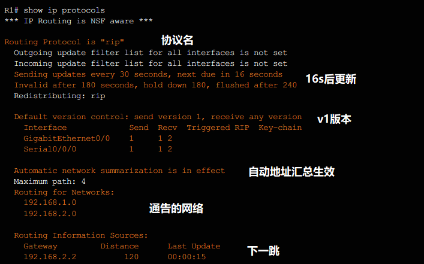
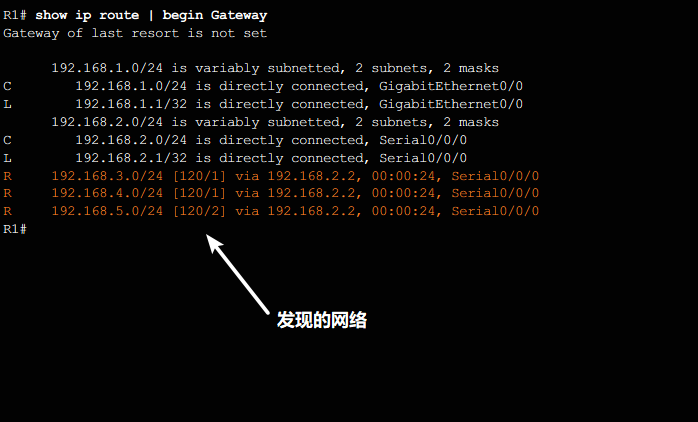
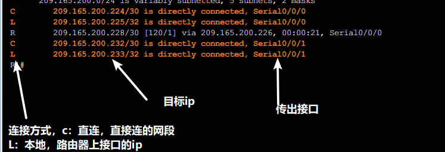
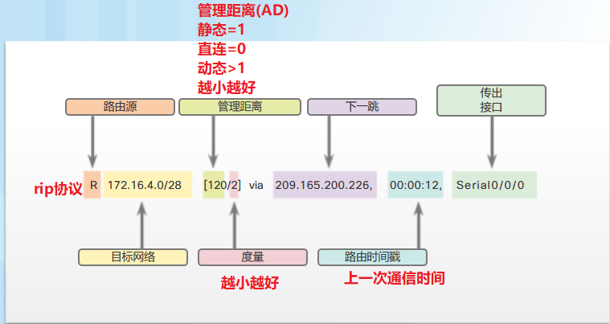
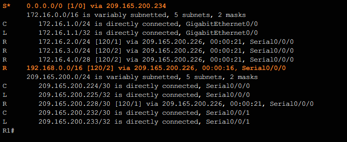
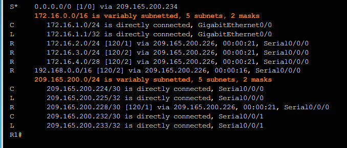
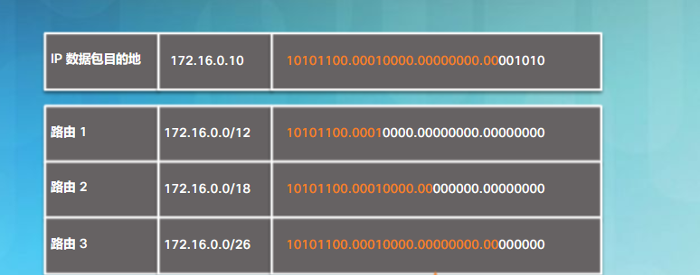
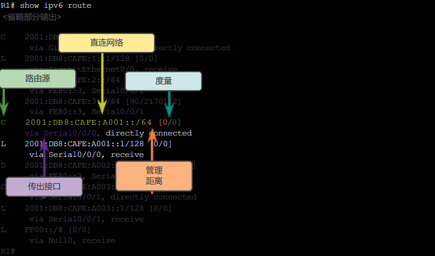
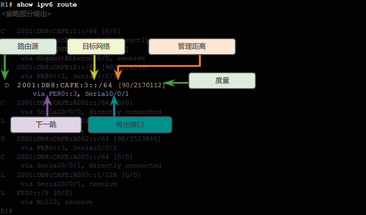

# 动态路由
categories: 思科2
## 动态路由协议

### 概述

#### 发展历程

* 1988, RIPv1
* 开放最短路径优先OSPF
* 中间系统到中间系统IS-IS
* (思科推出面向大型网络)内部网关路由协议(IGRP), 及其增强型(EIGRP)
* 边界网关协议BGP

#### 动态路由协议

动态路由协议用于路由器之间交换路由信息, 作用包括

* 发现远程网络
* 动态更新路由信息
* 确定最佳路径
* 当前路径无法使用时找出最佳路径

组成部分为

* 数据结构: 路由表或数据库. 保存在内存中
* 路由协议消息: 路由器之间沟通方法. 统一的消息, 找到附近路由, 交换信息, 维护网络
* 算法: 确定最佳路径

#### 静态/动态路由优缺点

静态优点

* 末端网络
* 不会增长的小型网络
* 访问单一的路由

静态缺点

* 大型网络实施难
* 管理耗时
* 不会动态更新

动态优点

* 适用于大型网络
* 可以自动适应网络拓扑的改变

动态缺点

* 不够安全
* 占用资源

## RIPv2

几乎不使用

#### RIPv1

* 启动/停止

  ```
  router rip // 默认运行ripv1
  no router rip
  ```

* 通告直连网络的**有类ip地址**, 通告的接口会开始发送和接受rip更新, 每30s通告网络

  ```
  router rip
  (config-router)
  network 192.168.1.0
  network 192.168.2.0
  ```

* 查看配置

  ```
  show ip protocols
  ```

  

  ```
  show ip route | begin Gateway
  ```

  

  

#### RIPv2

* 启用

  ```
  router rip
  (config-router)
  version 2
  ```

* 禁用自动汇总. 默认会在主网边界上自动汇总网络. 只有v2才可以禁用

  ```
  (config-router)
  no auto-summary
  ```

  

#### 被动接口

频繁而不需要的rip信息会造成

* 浪费带宽
* 设备处理rip信息会耗费资源
* rip被截获, 带来风险.

配置被动接口, 只允许接口接收更新, 不发出更新. 这个接口的网络可以通过其他接口发出.

```
router rip
passive-interface g0/0
end
```

把所有接口设置为默认接口

```
passive-interface default
```

启用接口

```
no passive-interface
```

#### 传播默认路由

一般来说, 一个网络中只有一个接口接到ISP, 想联通互联网的数据都必须走这个接口. 把这个接口设置为默认静态路由, 然后通告.

```
(config)
ip route 0.0.0.0 0.0.0.0 s0/0/1 209.168.200.226
router rip
default-information originate
end
```

## 路由表

### IPv4路由表组成部分

* 本地

  

* 远程

  

  

路由源(ip的获取方式)中关于远程网络的代号

* S: 静态
* D: EIGRP协议获取
* O: OSPF
* R: RIP

### 路由表分级

* 最终路由

  包含下一跳IPv4地址或送出接口的路由表条目. 例如动态获取的直连本地路由

  

* 一级路由

  子网掩码小于等于网络地址有类掩码

  * 网络路由: 子网掩码等于有类掩码. eg. `192.168.1.0/24`
  * 超网路由: 掩码小于有类掩码. `192.168.0.0/16`
  * 默认路由: `0.0.0.0/0`

  路由源可以是直连网络, 静态路由, 动态路由.

  

* 一级父路由

  划分子网的一级路由, 不能是最终路由

  

* 二级子路由

  一级父路由的子路由

### IPv4路由查找

#### 路由查找过程

* 匹配一级路由
  * 匹配到最终路由, 成功
  * 匹配到一级父路由
    * 匹配子路由
      * 匹配成功
      * 匹配失败
        * 匹配1级超网路由
          * 匹配成功
          * 匹配失败, 默认路由

> 如果未使用思科快速转发 (CEF)，仅引用下一跳 IP 地址而不引用退出接口的路由必须解析为具有退出接口的路由。在没有 CEF 的情况下，会对下一跳 IP 地址执行递归查找，直到将该路由解析为某个退出接口。默认情况下，启用 CEF。 

#### 最佳路由=最长匹配

>  要使数据包的目标 IPv4 地址和路由表中的路由形成匹配，两者之间从最左侧开始必须存在最少匹配位数。这个最少匹配位数由路由表中路由的子网掩码决定。 

和路由器的子网处在一个网段, 且路由器子网包含的主机数量最少, 就转发给这个路由.

最**精确**地转发数据包



路由3的子网掩码可以满足数据包的ip而且最长, 因此转发给路由3.

## IPv6路由

* IPv6是无类的, 所有路由都是1级最终路由

### 直连



### 远程



[pt实践](./2019-11-25-ch03pt实践.md)

