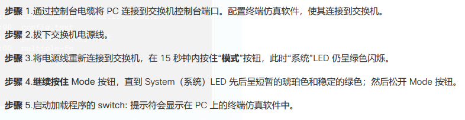
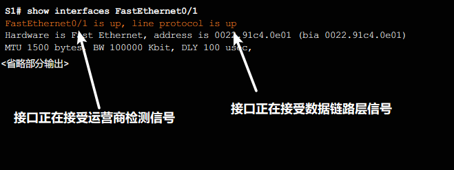
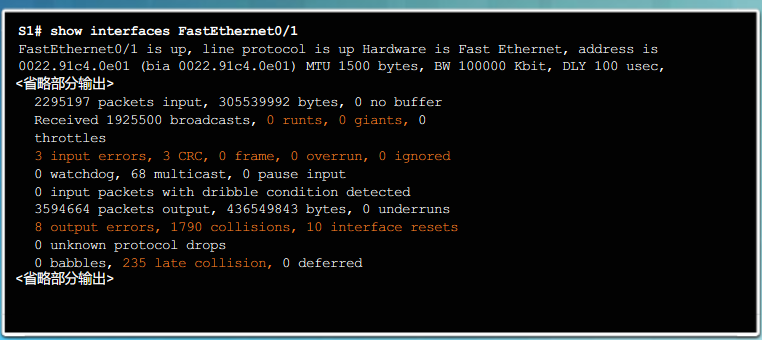

# 交换机配置
categories: 思科2
## 基本配置

### 通过初始配置设置交换机

#### 交换机启动顺序

* POST: power on self test 加电自检. 

* 引导程序: 存放在rom中

* 低级cpu初始化: 初始化cpu寄存器

* 启动初始化系统主板的flash系统

* 加载ios到内存

  * 用boot环境变量的信息启动

    * 环境变量未设置-找flash中第一个可执行文件

    ```
    show boot // 查看启动文件设置
    boot system flash://..... // 指定启动文件
    ```

    

  * 开机后在nvram中找到startup config

#### 修复系统



进入到恢复模式, 可以格式化操作系统, 重新安装操作系统, 回复密码

#### LED指示灯

* 系统: 绿色-正常, 琥珀色-不正常, 不亮-未开机
* 冗余电源(RPS): 不亮-未发现RPS, 绿色-正常, 闪烁-RPS正在为其他设备供电, 琥珀色-RPS故障, 琥珀色闪烁-RPS正在供电.
* 端口状态: 
  * 绿色-一条链路, 
  * 绿色闪烁-传输数据, 
  * 绿色琥珀色交替-故障. 
  * 琥珀色-端口阻塞, 正在确保转发域不存在环路; 端口被激活30s内是这个状态
  * 琥珀色闪烁-端口阻塞, 转发域存在环路;
* 端口双工LED, 绿色: 全双工, 不亮: 半双工, 
* 端口速度LED, 绿色: 100Mbps, 绿色闪烁: 1000Mbps, 不亮: 10Mbps
* 以太网供电(PoE), 
  * 不亮: 没有使用PoE. 
  * 琥珀色闪烁: 没有选择PoE, 但是有一个端口断电或故障
  * 绿色: 选择了PoE
  * 绿色琥珀色交替: PoE被拒绝, 用电设备的供电超过交换机电源容量
  * 琥珀色闪烁: 故障关闭
  * 琥珀色: 禁用PoE

## 配置交换机端口

#### 准备基本交换机管理

想远程管理访问交换机, 必须配置ip, 子网掩码, 如果是其他网络访问还要配置默认网关. 配置到虚拟接口SVI上

所有端口默认是分给vlan1的. 所以SVI也是默认给vlan1. 最好是将SVI分配给另一个vlan. 

```
conf t
inter vlan 99
ip addr ...
no shut
end
(config)
ip default-gateway ...
end
(en)
copy run start
```

#### 配置全双工

交换机都有自动协商功能(默认启用), 但是连接到专用设备的时候, 手动配置非常有用.

```
conf t
inter g0/0
duplex full // 全双工
speed 100 // 100Mbps
end
```

1000Mbps只能在全双工下工作

#### MDIX

auto-MDIX自动检测直通/交叉, 自动配置, 但是连接到服务器/工作站等没有自动MDIX的, 就需要手动选择电缆. 启用MDIX:

```
conf t
inter g0/0
duplex auto
speed auto
mdix auto
end
```

#### 验证配置

```
show interfaces f0/18
show ip f0/18
show mac-address-table
show flash
```

### 接入层故障排除



* 接口up, 协议down, 说明另一端接口可能被禁用, 查看是否有`EMI/noise`, 找到噪声源. 双工配置是否正确. 
* 接口协议都down, 说明电缆未链接/损坏, 接口损坏, 接口速度不匹配造成问题
* 管理性关闭, 说明被手动禁用



* 如果CRC错误多, 说明电缆可能存在问题(电磁干扰)
* 冲突: 半双工时会存在. 全双工不会存在冲突
* 延迟冲突: 传输了512位的帧之后发生冲突. 可能由于电缆过长, 一端是全双工而另一端是半双工.

## 安全性

### 配置SSH

* 配置步骤

  ```
  show ip ssh // 检查是否支持ssh
  conf t // 全局配置
  ip domain-name cisco.com // 配置ip域名
  crypto key generate rsa // 生成rsa密钥对
  username admin secret ccna // 创建用户
  line vty 0 15 // 在vty0-15上启用
  transport input ssh // 只接受ssh
  login local // 从本地用户名数据库验证身份
  exit
  ip ssh version 2 // 开启第二版ssh
  exit
  ```

### 保护未使用端口安全

* 禁用未使用端口

  ```
  interface range f0/1 - 15
  (config-if-range)
  shutdown
  ```

* 安全mac地址: 限定端口的mac地址, 其他地址不可接入

  * 静态安全: 手动配置

  * 动态安全: 动态获取, 存储在地址表中, 重启后删除

  * 粘性安全: 动态获取或手动配置, 存储在地址表中, 添加到运行配置.

    ```
    switchport port-security mac-address sticky [mac-address] 
    no switchport port-security mac-address sticky //禁用
    ```

* 违规模式: 违反安全要求后

  * 保护: 安全MAC地址数量达到限制, 未知源的数据包会被丢弃, 不通知. 直至移除足够数量的安全 MAC 地址或增加允许的最大地址数 
  * 限制: 同保护, 只是会发出通知.
  * 关闭: 立刻禁用, `show interface f0/18`会显示`err-disabled`

  ```
  switchport port-security violation {protect | restrict | shutdown}
  ```

* 总结配置

  ```
  inter f0/18
  (config if)
  switchport mode access
  switchport port-security
  switchport port-security maximum 10
  switchport port-security mac-address sticky
  ```

* 查看配置

  ```
  (en)
  show port-security inter f0/18
  show port-security address
  ```

  

